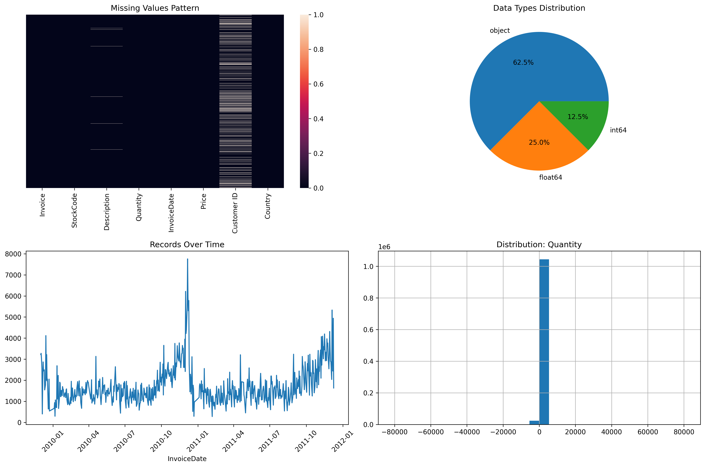

# E-commerce Business Intelligence Project: End-to-End ETL & Interactive Dashboards

## 🎯 Project Overview

This project delivers a comprehensive Business Intelligence solution for an e-commerce business, transforming raw sales data into actionable insights through a robust ETL pipeline, a star schema data warehouse, and interactive Power BI dashboards.

The core objective is to enable data-driven decision-making by providing a 360-degree view of business performance, customer behavior, and product trends. This solution showcases a complete BI lifecycle, from data ingestion and cleaning to advanced analytics and visualization.

**Key Achievements:**
* **Built 3 Interactive Dashboard Suites:** Executive Overview, Customer Analytics, and Operational Intelligence
* **Implemented Advanced Customer Segmentation:** 4-tier classification (VIP: 46.62%, Regular: 31.18%, Premium: 18.66%, New: 3.54%)
* **Developed Geographic Performance Tracking:** 10+ country analysis with YoY growth metrics
* **Created Dynamic Product Performance Matrix:** Revenue vs. Quantity analysis identifying top performers
* **Applied Sophisticated DAX Calculations:** Customer lifetime value, acquisition trends, and performance categorization

## 🛠️ Technical Stack

| Category                     | Tool / Technology                   | Description                                                                     |
| :--------------------------- | :---------------------------------- | :------------------------------------------------------------------------------ |
| **Data Ingestion & Cleaning** | Python (Pandas, pyodbc)             | Scripts for initial data loading, cleaning, and preparation before database insertion. |
| **Database Management** | SQL Server Express                  | Hosts the staging area and the optimized Star Schema Data Warehouse.            |
| **ETL & Data Transformation**| SQL (T-SQL)                         | Developed stored procedures and views for data manipulation, aggregation, and business logic implementation. |
| **Data Modeling & Viz.** | Power BI Desktop                    | Employed for creating interactive dashboards, defining the semantic model, and implementing complex DAX measures. |
| **Version Control** | Git & GitHub                        | Managed project source code, facilitated collaborative development, and tracked all changes. |
| **Development Environment** | Visual Studio Code                  | Primary IDE used for script development, SQL query authoring, and project management. |

## 🚀 Project Architecture & Data Flow

The project adheres to a standard Business Intelligence architectural pattern, designed for data integrity, performance, and scalability.

1.  **Raw Data Ingestion:**
    * E-commerce transaction data (CSV/Excel) is initially stored in the `data/raw` directory.
2.  **Staging Layer (SQL Server):**
    * Python scripts (`python/scripts/02_load_data_to_sql.py`) connect to SQL Server and load the cleaned raw data into the `staging.raw_sales` table.
3.  **ETL Process (SQL Server):**
    * A master ETL script (`sql/etl/00_run_full_etl.sql`) orchestrates the transformation:
        * **Date Dimension (`dw.DimDate`):** Populated with a comprehensive range of dates and attributes.
        * **Customer Dimension (`dw.DimCustomer`):** Populated with unique customer information and calculated attributes like `FirstPurchaseDate`, `LastPurchaseDate`, `TotalOrders`, and `TotalSpent`.
        * **Product Dimension (`dw.DimProduct`):** Populated with unique product details, including a custom `Category` based on description keywords.
        * **Sales Fact Table (`dw.FactSales`):** The central table, linking dimensions via surrogate keys and storing transactional metrics (`Quantity`, `UnitPrice`, `TotalAmount`).
4.  **Business Analysis Views (SQL Server):**
    * Pre-joined and aggregated views (`dw.vw_SalesSummary`, `dw.vw_MonthlySales`, `dw.vw_CustomerAnalysis`, `dw.vw_ProductPerformance`) are created on top of the data warehouse. These views simplify data consumption for Power BI and optimize query performance.
5.  **Power BI Visualization:**
    * Power BI Desktop connects directly to these SQL Server views, building an interactive data model, defining DAX measures, and creating the final dashboards.

## 📈 Visual Showcase

Below are key visual outputs from the project, demonstrating the progression from raw data insights to final interactive dashboards.

### 1. Initial Data Exploration

Before beginning transformations, an in-depth data exploration was conducted using Python. This provided critical insights into data quality issues such as missing values, data type inconsistencies, and outlier distributions, which were then addressed in the cleaning phase.


*Visualizations like missing value heatmaps and distribution plots were instrumental in understanding the dataset's characteristics and informing the data cleaning strategy.*

### 2. Executive Overview Dashboard

This dashboard serves as the central hub for leadership, providing a high-level summary of critical business performance indicators.


*It presents key metrics such as Total Revenue, Total Products Sold, Total Customers, and Average Order Value, alongside visualizations for revenue trends and top product performance.*

### 3. Customer Analysis Dashboard

Focused on understanding and segmenting the customer base, this dashboard provides insights into customer behavior, acquisition, and engagement.


*Key components include a customer portfolio overview segmented by value, a trend line for customer acquisition, and a detailed list of top customers by revenue.*

### 4. Operational Dashboard

Designed for operational teams, this dashboard offers detailed sales performance metrics by country and product category, aiding in strategic adjustments and identifying areas for improvement.


*Features include a year-over-year revenue comparison by country, identification of low-performing product categories, and a monthly trend analysis of total sales and quantity sold.*

## 🎯 Dashboard Features & Capabilities

### Executive Overview Dashboard
- **KPI Cards:** Total Revenue ($17.37M), Products Sold (10M), Active Customers (5,873), Avg Order Value ($470)
- **Quarterly Revenue Trends:** Visual identification of seasonal patterns and growth trajectories
- **Category Distribution:** 5-tier product portfolio analysis with percentage breakdowns
- **Product Performance Ranking:** Top performers with revenue and quantity metrics

### Customer Analytics Dashboard  
- **Customer Portfolio Segmentation:** Visual breakdown of customer tiers with percentage distribution
- **Acquisition Trend Analysis:** Monthly new customer tracking showing seasonal patterns
- **Top Customer Revenue Analysis:** Individual customer performance with dual-axis visualization
- **Multi-dimensional Filtering:** Year, Country, Customer Segment, and Category slicers

### Operational Dashboard
- **Geographic Performance Matrix:** Country-wise revenue with YoY growth percentages
- **Low Performer Identification:** Category-wise revenue analysis highlighting improvement opportunities  
- **Revenue vs. Quantity Scatter Analysis:** Product positioning and performance correlation
- **Monthly Trend Analysis:** Dual-metric tracking of sales and quantity patterns

## 🔗 Data Model & Relationships

The Power BI solution implements a optimized star schema data model ensuring efficient query performance and intuitive user experience.


### Data Model Architecture:
- **Central Fact Table:** `dw FactSales` serves as the transaction hub storing all sales metrics
- **Dimension Tables:** Four key dimensions provide context and filtering capabilities:
  - `dw DimDate` - Comprehensive date attributes with calendar hierarchies
  - `dw DimCustomer` - Customer profiles with calculated lifetime metrics
  - `dw DimProduct` - Product catalog with performance categorization
  - `dw vw_ProductPerformance` - Pre-aggregated product metrics for enhanced performance

### Business Views Integration:
- **`dw vw_SalesSummary`** - Pre-joined sales data optimized for dashboard consumption
- **`dw vw_CustomerAnalysis`** - Customer-centric metrics with segmentation logic
- **Relationship Integrity:** All relationships maintain referential integrity with proper cardinality (1-to-many from dimensions to facts)

### Performance Optimizations:
- **Star schema design** minimizes joins and maximizes query performance
- **Calculated columns** in dimensions reduce computation overhead in visuals
- **Aggregated views** provide pre-computed metrics for faster dashboard loading
- **Proper indexing** on relationship keys ensures efficient data retrieval

## 🛠️ Advanced Power BI Techniques Implemented

- **Custom DAX Measures:** Complex calculations for customer segmentation and performance metrics
- **Dynamic Segmentation:** 4-tier customer classification based on purchasing behavior  
- **Cross-Dashboard Navigation:** Seamless tab-based navigation system
- **Advanced Visualizations:** Scatter plots, dual-axis charts, and custom KPI cards
- **Interactive Filtering:** Multi-dimensional slicers with cross-visual filtering
- **Performance Optimization:** Efficient data model design supporting real-time dashboard interactions
- **Conditional Formatting:** Color-coded performance indicators and trend visualization

## ⚙️ How to Set Up and Run the Project

To set up and run this project locally, follow these steps:

### Prerequisites:
* **Python 3.9+:** Ensure "Add Python to PATH" is selected during installation.
* **SQL Server Express:** Download and install the free version of SQL Server.
* **SQL Server Management Studio (SSMS):** For managing your SQL Server instance and executing SQL scripts.
* **Power BI Desktop:** Download and install the free data visualization tool.
* **Git:** For cloning the repository.
* **Visual Studio Code:** Recommended for code editing and project management.

### Setup Steps:
**Estimated Time:** 30-45 minutes

1.  **Clone the Repository:**
    Open your terminal or command prompt and run:
    ```bash
    git clone https://github.com/danieljingtailiu/End-to-End-ETL-Ecommerce-Dashboard.git
    cd End-to-End-ETL-Ecommerce-Dashboard
    ```

2.  **Set Up Python Environment & Install Dependencies:**
    ```bash
    python -m venv venv
    # For Windows:
    venv\Scripts\activate
    # For Mac/Linux:
    source venv/bin/activate
    pip install -r requirements.txt
    ```

3.  **Download Raw Dataset:**
    * Obtain the `data.csv` file from [Kaggle: E-Commerce Data](https://www.kaggle.com/datasets/carrie1/ecommerce-data) or the `Online Retail.xlsx` file from [UCI Machine Learning Repository: Online Retail](https://archive.ics.uci.edu/ml/datasets/Online+Retail).
    * Place the downloaded file into the `data/raw/` directory of your project (e.g., `data/raw/ecommerce_data.csv`).

4.  **Create SQL Server Database & Tables:**
    * Open **SQL Server Management Studio (SSMS)**.
    * Execute the script: `sql/schema/01_create_database.sql` to create the `ECommerceAnalytics` database.
    * Execute the script: `sql/schema/02_create_tables.sql` to create the `staging.raw_sales` table and all data warehouse (`dw`) dimension and fact tables.

5.  **Load Raw Data into SQL Server Staging:**
    * With your Python virtual environment activated, run the Python script:
        ```bash
        python python/scripts/02_load_data_to_sql.py
        ```
    * This script will clean the raw data and efficiently load it into the `staging.raw_sales` table.

6.  **Execute the ETL Process:**
    * In SSMS, open and execute the master ETL script: `sql/etl/00_run_full_etl.sql`.
    * This script will orchestrate the full ETL process, populating all `dw` dimension tables (`DimDate`, `DimCustomer`, `DimProduct`), the `FactSales` table, and creating the necessary business analysis views in the `dw` schema.

7.  **Open and Explore Power BI Dashboard:**
    * Open the Power BI Desktop application.
    * Open the `.pbix` file located in the `powerbi/` folder (you'll create this file as you build your Power BI dashboards based on the provided guide).
    * Ensure the data source settings within Power BI are configured to connect to your local SQL Server instance (typically `localhost` or `.\SQLEXPRESS`) using Windows Authentication.

## 📂 Project Structure
```ecommerce-business-intelligence/
├── data/
│   ├── raw/                 # Contains the raw downloaded datasets (e.g., ecommerce_data.csv)
│   └── processed/           # (Optional) Directory for cleaned/intermediate datasets if used in Python
├── sql/
│   ├── schema/              # SQL scripts for database and initial table creation (e.g., 01_create_database.sql)
│   ├── etl/                 # SQL scripts for the ETL process, populating dimensions and facts (e.g., 00_run_full_etl.sql)
│   └── analysis/            # SQL scripts for creating business analysis views and advanced queries
├── python/
│   ├── notebooks/           # Jupyter notebooks for ad-hoc data exploration and prototyping
│   └── scripts/             # Python scripts for data loading, cleaning, and database interaction (e.g., 02_load_data_to_sql.py)
├── powerbi/                 # Stores Power BI Desktop files (.pbix) and connection guides
├── images/                  # Contains screenshots of dashboards and data exploration visuals
├── docs/                    # Comprehensive project documentation (e.g., project_overview.md, technical_architecture.md)
└── requirements.txt         # Lists all Python package dependencies for easy installation
```

## ✍️ Author

[Daniel Liu/danieljingtailiu](https://github.com/danieljingtailiu)

## 📜 License

This project is licensed under the MIT License - see the [LICENSE](LICENSE) file for more details.

---